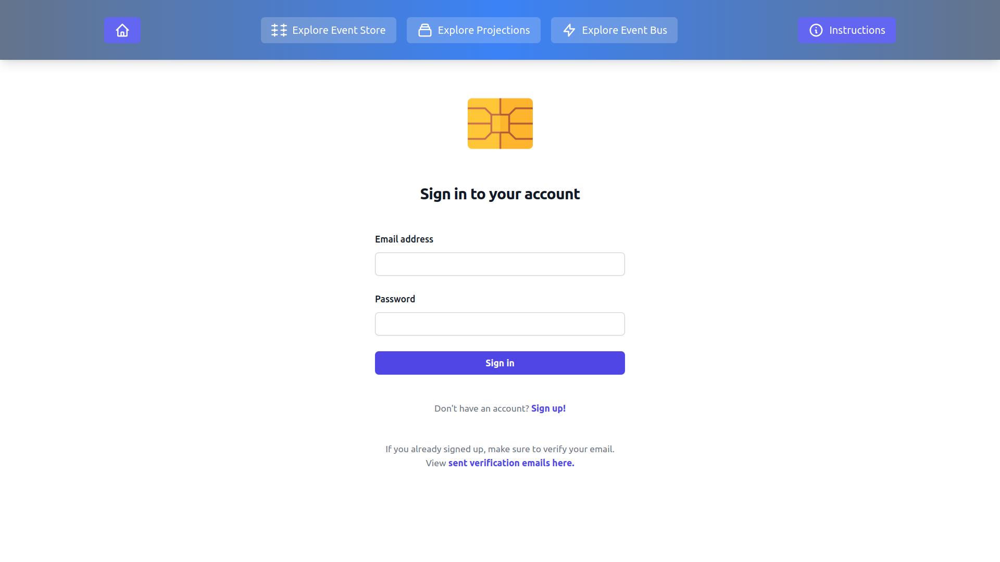

# Event Sourcing Course - Example Application

This repository contains an example event sourced application, used in Ambar's Event Sourcing course. You can take
(or retake) the course for free [in this link](https://ambar.cloud/esd).

## Getting Started

To run this application you need Docker. Once you have Docker installed, please clone the code, 
navigate to `local-development` and run `dev_start.sh`.

```bash
git clone git@github.com:ambarltd/courses-v2.git
cd courses-v2/local-development/scripts/linux/ # if you're on linux
cd courses-v2/local-development/scripts/mac/ # if you're on mac
./dev_start.sh
```

Now open your browser to `localhost:8080` and try the application out! You will receive 
further instructions in the top menu.




## Contents

This example application contains an event sourced financial institution that allows you to:

1. Sign up
2. Verify your email
3. Sign in / sign out
4. View credit card products you can enrol in (Platinum and Starter)
5. Request an enrollment into a credit card product

The code for `1.`, `2.`, `3.`, and `4.`, is written in PHP, and lives 
at `application/backend-php`. The code for `5.` is written in other languages 
to help you understand event sourcing in your preferred language. Currently,
`5.` is available in Java, C#, and Typescript.

By default `5` is deployed with Java. But if you'd like to change that, 
simply head to `local-development/docker-compose.yml` and change the 
`backend-credit-card-enrollment` service to use the directory corresponding 
to your preferred language. 

## Building More

If you change the code, simply redeploy your Docker containers, and refresh your browser.

```bash
cd courses-v2/local-development/scripts/linux/ # For Linux
cd courses-v2/local-development/scripts/mac/ # For Mac

./dev_start.sh 
./dev_start_with_data_deletion.sh # use this if you want to delete your existing event store, and projection db

./dev_start.sh 
./dev_start_with_data_deletion.sh # use this if you want to delete your existing event store, and projection db
# Windows support (todo) - feel free to add a Pull Request ;)
```

## Making Sense of the Code

To make sense of this application, please review the slides and recordings you received during your course. 

[//]: <> (TODO: Include a structure for the various events in the system.)

```markdown

application/                         # Source code
├── frontend-javascript/             # Source code for the frontend
└── backend-php/                     # Source code for the backend (parts 1-4)
└── backend-credit-card-enrollment/  # Source code for the backend (part 5)

cloud-deployment-examples/  # Infrastructure code examples, in case you ever want to deploy this to the cloud.

local-development/          # Local development environment defined with Docker Compose
│
│
├── docker-compose.yml      # Docker Compose definition
│                           #     Includes an event store (Postgres), projection db (Mongo),
│                           #     backends, frontend (JavaScript + Nginx), and an Ambar 
│                           #     emulator (for projections and reactions)
│
│
├── ambar-config.yml        # Configuration for Ambar emulator
│                           #     Needed for projections and reactions as per 
│                           #     https://hub.docker.com/r/ambarltd/emulator
│
├── scripts.                # Scripts to start/stop the application's containers.
```

## Support

If you get stuck, please ask us questions in the #event-sourcing channel of our Slack community. 
If you're not part of our Slack, please sign up [here](https://www.launchpass.com/ambar). 
Or if you'd like a free private walkthrough, simply book one [here](https://calendly.com/luis-ambar).

